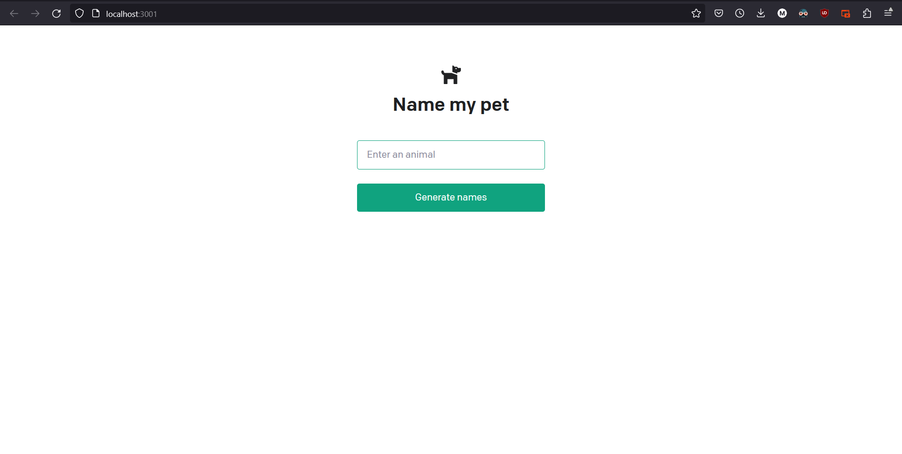

[](https://classroom.github.com/open-in-codespaces?assignment_repo_id=13297835)

# Business Slogan Generator

Use theOpenAI Completion API to generate slogans for a business based on a business description.

This is the webpage in it's initial state:


And this is the previous year's assignment webpage:



But this year's business slogan generator webpage is the one chosen as a base for this project.

## Adding a button

From this look:


And even though the completion is interacted with by a `onChange` basis, for the sake of having a more user friendly AI lets add a `Send` button:

```js
  <form onSubmit={handleSubmit}>
    <input
      className="fixed w-full max-w-md bottom-0 border border-gray-300 rounded mb-8 shadow-xl p-2 dark:text-black"
      value={input}
      placeholder="Describe your business..."
      onChange={handleInputChange}
    />
    <button
      disabled={isLoading}
      className='fixed bottom-0 ml-100 border border-gray-300 rounded mb-8 shadow-xl p-2'
    >
      Send
    </button>
```

After obtaining the `isLoading` property from `useCompletion()`:

```js
  const {
        isLoading,
        completion,
        input,
        handleInputChange,
        handleSubmit
      }
      = useCompletion();
```

It was sent to the bottom after assigning some tailwind classes to it:


And because the `disabled` prop is assigned that `isLoading` variable then it will not allow to resend the completion inbetween loads.

## Changing the style

After messing around a bit with the colors and the gradients this is the final result:


>> It is not working in the screenshot due to not having an OpenAI token.
> - Marcos Barrios
